R Notebook
================

## Definition of Forecasting

Forecasting in time series analysis refers to the process of making
predictions about future values based on previously observed values. It
involves using historical patterns, trends, and relationships within the
data to project future outcomes.

### Deterministic Approaches

Deterministic forecasting models assume that future values are
completely determined by past values, with no random components. These
approaches:

- Rely on mathematical equations that precisely define the relationship
  between variables
- Do not account for randomness or uncertainty in predictions
- Work well for systems with clear, stable patterns and minimal noise
- Include methods like linear regression, exponential smoothing, and
  decomposition techniques

### 1. Linear Trend Model

``` r
# Generate sample time series with linear trend
set.seed(123)
t <- 1:100
y <- 10 + 0.5*t + rnorm(100, 0, 5)
ts_data <- ts(y)

# Fit linear trend model
time_index <- time(ts_data)  # Extract time index
linear_model <- lm(ts_data ~ time_index)  # Use correct time variable

# Forecast next 10 periods
new_time <- data.frame(time_index = seq(101, 110))  # Ensure column name matches

# Predict future values
forecast_values <- predict(linear_model, newdata = new_time)

# Plot results
plot(ts_data, xlim = c(1, 110), ylim = c(min(y, forecast_values), max(y, forecast_values)),
     main = "Linear Trend Forecast")
lines(101:110, forecast_values, col = "red", lwd = 2)
```

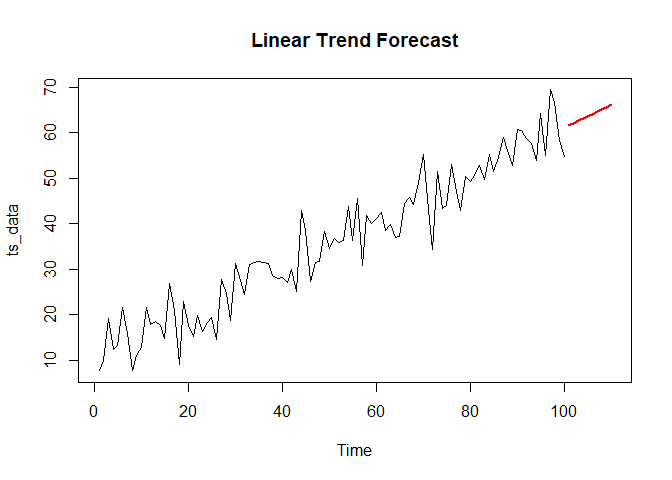<!-- -->

### 2. Polynomial Trend Model

``` r
# Generate sample time series with quadratic trend
set.seed(123)
t <- 1:100
y <- 10 + 0.5*t + 0.02*t^2 + rnorm(100, 0, 5)
ts_data <- ts(y)

# Fit quadratic trend model
time_index <- time(ts_data)  # Extract time index explicitly
quad_model <- lm(ts_data ~ time_index + I(time_index^2))  # Quadratic regression

# Forecast next 10 periods
new_time <- data.frame(time_index = 101:110)  # Ensure column name matches model
forecast_values <- predict(quad_model, newdata = new_time)

# Plot results
plot(ts_data, xlim = c(1, 110), ylim = c(min(y, forecast_values), max(y, forecast_values)),
     main = "Quadratic Trend Forecast")
lines(101:110, forecast_values, col = "red", lwd = 2)
```

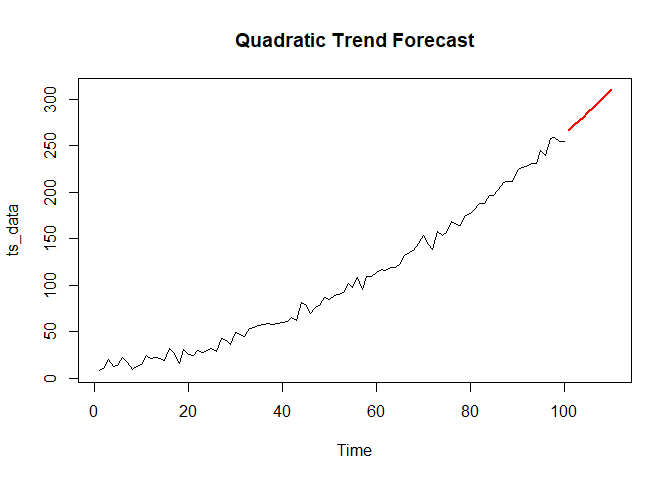<!-- -->

### 3. Simple Exponential Smoothing (SES) in Time Series Forecasting

``` r
library(forecast)
```

    ## Warning: package 'forecast' was built under R version 4.4.3

    ## Registered S3 method overwritten by 'quantmod':
    ##   method            from
    ##   as.zoo.data.frame zoo

``` r
# Generate sample time series without trend or seasonality
set.seed(123)
y <- 100 + rnorm(100, 0, 10)
ts_data <- ts(y)

# Apply simple exponential smoothing
ses_model <- ses(ts_data, h = 10)  # h is the forecast horizon
summary(ses_model)
```

    ## 
    ## Forecast method: Simple exponential smoothing
    ## 
    ## Model Information:
    ## Simple exponential smoothing 
    ## 
    ## Call:
    ## ses(y = ts_data, h = 10)
    ## 
    ##   Smoothing parameters:
    ##     alpha = 1e-04 
    ## 
    ##   Initial states:
    ##     l = 100.904 
    ## 
    ##   sigma:  9.1751
    ## 
    ##      AIC     AICc      BIC 
    ## 907.7948 908.0448 915.6103 
    ## 
    ## Error measures:
    ##                       ME     RMSE      MAE        MPE     MAPE      MASE
    ## Training set 0.002147347 9.082857 7.293103 -0.8230312 7.319355 0.7233504
    ##                     ACF1
    ## Training set -0.02560101
    ## 
    ## Forecasts:
    ##     Point Forecast    Lo 80    Hi 80    Lo 95    Hi 95
    ## 101        100.904 89.14569 112.6623 82.92121 118.8868
    ## 102        100.904 89.14569 112.6623 82.92121 118.8868
    ## 103        100.904 89.14569 112.6623 82.92121 118.8868
    ## 104        100.904 89.14569 112.6623 82.92121 118.8868
    ## 105        100.904 89.14569 112.6623 82.92121 118.8868
    ## 106        100.904 89.14569 112.6623 82.92121 118.8868
    ## 107        100.904 89.14569 112.6623 82.92121 118.8868
    ## 108        100.904 89.14569 112.6623 82.92121 118.8868
    ## 109        100.904 89.14569 112.6623 82.92121 118.8868
    ## 110        100.904 89.14569 112.6623 82.92121 118.8868

``` r
# Plot results
plot(ses_model, main = "Simple Exponential Smoothing Forecast")
```

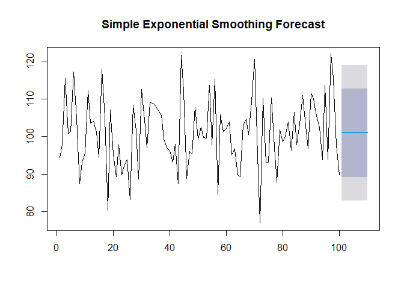<!-- -->

### 4. Holt’s Linear Method (Double Exponential Smoothing) in Time Series Forecasting

``` r
# Generate sample time series with trend
set.seed(123)
t <- 1:100
y <- 100 + 0.5*t + rnorm(100, 0, 5)
ts_data <- ts(y)

# Apply Holt's method
holt_model <- holt(ts_data, h = 10)
summary(holt_model)
```

    ## 
    ## Forecast method: Holt's method
    ## 
    ## Model Information:
    ## Holt's method 
    ## 
    ## Call:
    ## holt(y = ts_data, h = 10)
    ## 
    ##   Smoothing parameters:
    ##     alpha = 0.0411 
    ##     beta  = 1e-04 
    ## 
    ##   Initial states:
    ##     l = 102.2959 
    ##     b = 0.4988 
    ## 
    ##   sigma:  4.7607
    ## 
    ##      AIC     AICc      BIC 
    ## 778.5148 779.1531 791.5406 
    ## 
    ## Error measures:
    ##                      ME     RMSE      MAE        MPE     MAPE      MASE
    ## Training set -0.2164108 4.664538 3.771038 -0.3897533 3.064286 0.7530136
    ##                     ACF1
    ## Training set -0.01908949
    ## 
    ## Forecasts:
    ##     Point Forecast    Lo 80    Hi 80    Lo 95    Hi 95
    ## 101       151.4377 145.3365 157.5388 142.1068 160.7685
    ## 102       151.9343 145.8280 158.0406 142.5955 161.2730
    ## 103       152.4309 146.3194 158.5424 143.0842 161.7776
    ## 104       152.9275 146.8108 159.0442 143.5728 162.2822
    ## 105       153.4241 147.3022 159.5461 144.0614 162.7869
    ## 106       153.9208 147.7936 160.0480 144.5500 163.2915
    ## 107       154.4174 148.2849 160.5499 145.0386 163.7962
    ## 108       154.9140 148.7762 161.0518 145.5271 164.3010
    ## 109       155.4106 149.2675 161.5537 146.0156 164.8057
    ## 110       155.9073 149.7588 162.0557 146.5040 165.3105

``` r
# Plot results
plot(holt_model, main = "Holt's Linear Method Forecast")
```

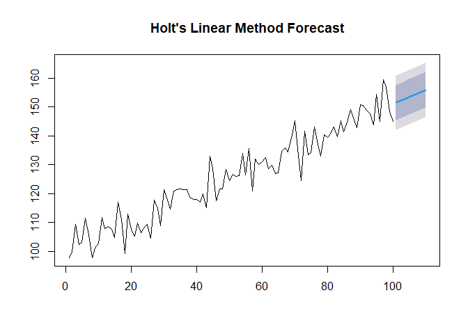<!-- -->

### 5. Holt-Winters Method (Triple Exponential Smoothing) in Time Series Forecasting

``` r
# Generate sample time series with trend and seasonality
set.seed(123)
t <- 1:100
trend <- 0.2*t
seasonal <- 15*sin(2*pi*t/12)  # Period of 12
y <- 100 + trend + seasonal + rnorm(100, 0, 5)
ts_data <- ts(y, frequency = 12)

# Apply Holt-Winters method
hw_model <- hw(ts_data, seasonal = "additive", h = 24)
summary(hw_model)
```

    ## 
    ## Forecast method: Holt-Winters' additive method
    ## 
    ## Model Information:
    ## Holt-Winters' additive method 
    ## 
    ## Call:
    ## hw(y = ts_data, h = 24, seasonal = "additive")
    ## 
    ##   Smoothing parameters:
    ##     alpha = 0.0204 
    ##     beta  = 1e-04 
    ##     gamma = 1e-04 
    ## 
    ##   Initial states:
    ##     l = 101.4021 
    ##     b = 0.1998 
    ##     s = -0.8983 -7.8926 -11.784 -15.6007 -11.8218 -6.2878
    ##            0.7851 5.1318 14.4574 15.258 10.8419 7.8109
    ## 
    ##   sigma:  4.9486
    ## 
    ##      AIC     AICc      BIC 
    ## 796.9007 804.3641 841.1886 
    ## 
    ## Error measures:
    ##                     ME     RMSE      MAE        MPE     MAPE      MASE
    ## Training set -0.211352 4.535423 3.649021 -0.4133358 3.385883 0.5967649
    ##                    ACF1
    ## Training set 0.01870651
    ## 
    ## Forecasts:
    ##        Point Forecast    Lo 80    Hi 80     Lo 95    Hi 95
    ## May  9       125.9812 119.6394 132.3231 116.28225 135.6802
    ## Jun  9       121.8323 115.4892 128.1755 112.13132 131.5334
    ## Jul  9       114.9565 108.6120 121.3010 105.25341 124.6596
    ## Aug  9       109.6203 103.2745 115.9662  99.91517 119.3255
    ## Sep  9       106.0395  99.6923 112.3868  96.33228 115.7468
    ## Oct  9       110.0532 103.7046 116.4018 100.34386 119.7626
    ## Nov  9       114.1434 107.7934 120.4934 104.43193 123.8549
    ## Dec  9       121.3341 114.9827 127.6855 111.62046 131.0477
    ## Jan 10       130.2429 123.8901 136.5957 120.52707 139.9587
    ## Feb 10       133.4711 127.1168 139.8254 123.75309 143.1891
    ## Mar 10       138.0841 131.7284 144.4399 128.36392 147.8044
    ## Apr 10       137.4799 131.1227 143.8371 127.75744 147.2024
    ## May 10       128.3533 121.9946 134.7119 118.62853 138.0780
    ## Jun 10       124.2044 117.8442 130.5645 114.47735 133.9314
    ## Jul 10       117.3285 110.9669 123.6902 107.59920 127.0578
    ## Aug 10       111.9923 105.6292 118.3555 102.26072 121.7240
    ## Sep 10       108.4116 102.0469 114.7763  98.67760 118.1455
    ## Oct 10       112.4252 106.0590 118.7915 102.68893 122.1616
    ## Nov 10       116.5155 110.1477 122.8832 106.77675 126.2541
    ## Dec 10       123.7061 117.3368 130.0755 113.96504 133.4472
    ## Jan 11       132.6149 126.2440 138.9859 122.87140 142.3584
    ## Feb 11       135.8431 129.4706 142.2157 126.09717 145.5891
    ## Mar 11       140.4562 134.0820 146.8303 130.70775 150.2046
    ## Apr 11       139.8519 133.4762 146.2277 130.10103 149.6028

``` r
# Plot results
plot(hw_model, main = "Holt-Winters Method Forecast")
```

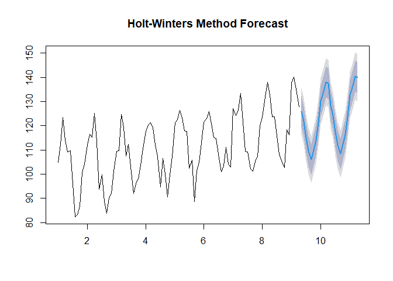<!-- -->

### 6. Classical Decomposition in Time Series Analysis

``` r
# Generate sample time series
set.seed(123)
t <- 1:120
trend <- 0.3*t
seasonal <- 20*sin(2*pi*t/12)
y <- trend + seasonal + rnorm(120, 0, 5)
ts_data <- ts(y, frequency = 12)

# Classical decomposition
decomp <- decompose(ts_data)
plot(decomp)
```

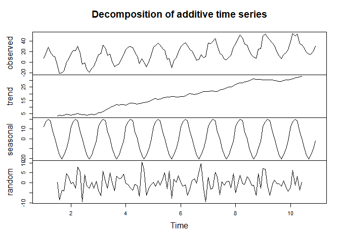<!-- -->

``` r
# Extract time index and remove NA values from trend component
time_index <- time(ts_data)
valid_trend <- na.omit(decomp$trend)
valid_time <- time_index[!is.na(decomp$trend)]  # Matching time values

# Fit trend model
trend_model <- lm(valid_trend ~ valid_time)

# Forecast next 12 months
future_time <- data.frame(valid_time = seq(121, 132))
trend_forecast <- predict(trend_model, newdata = future_time)

# Handling NA values in trend forecast
if (any(is.na(trend_forecast))) {
  trend_forecast[is.na(trend_forecast)] <- tail(valid_trend, 1)
}

# Extract seasonal pattern (repeating every 12 months)
season_forecast <- decomp$seasonal[1:12]

# Compute final forecast
forecast_values <- trend_forecast + season_forecast

# Plot results
plot(ts_data, xlim = c(1, 132), ylim = range(c(y, forecast_values), na.rm = TRUE),
     main = "Classical Decomposition Forecast")
lines(121:132, forecast_values, col = "red", lwd = 2)
```

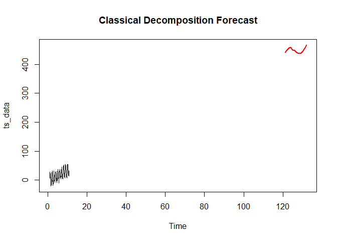<!-- -->

### 7. STL (Seasonal and Trend decomposition using LOESS) in Time Series Analysis

``` r
library(forecast)

# Generate sample time series
set.seed(123)
t <- 1:120
trend <- 0.3*t
seasonal <- 20*sin(2*pi*t/12)
y <- trend + seasonal + rnorm(120, 0, 5)
ts_data <- ts(y, frequency = 12)

# STL decomposition
stl_decomp <- stl(ts_data, s.window = "periodic")
plot(stl_decomp)
```

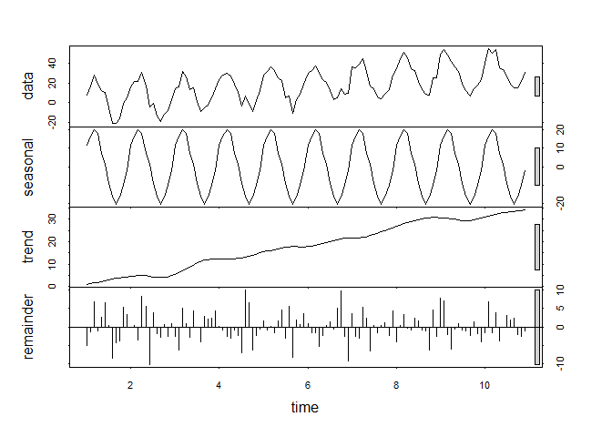<!-- -->

``` r
# Forecast using STL
stl_forecast <- forecast(stl_decomp, method = "naive", h = 24)
plot(stl_forecast, main = "STL Decomposition Forecast")
```

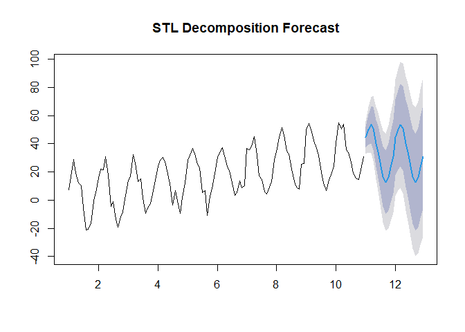<!-- -->

### 8. Singular Spectrum Analysis (SSA) in Time Series Analysis

``` r
library(Rssa)
```

    ## Warning: package 'Rssa' was built under R version 4.4.3

    ## Loading required package: svd

    ## Warning: package 'svd' was built under R version 4.4.3

    ## 
    ## Attaching package: 'Rssa'

    ## The following object is masked from 'package:stats':
    ## 
    ##     decompose

``` r
# Generate sample time series
set.seed(123)
t <- 1:100
trend <- 0.2*t
seasonal <- 15*sin(2*pi*t/12)
y <- trend + seasonal + rnorm(100, 0, 3)
ts_data <- ts(y)

# Apply SSA
ssa_decomp <- ssa(ts_data, L = 48)
plot(ssa_decomp)
```

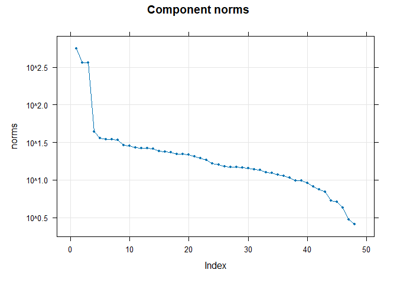<!-- -->

``` r
# Reconstruct components
groups <- list(trend = 1, seasonal = c(2,3), noise = c(4:10))
recon <- reconstruct(ssa_decomp, groups = groups)
plot(recon)
```

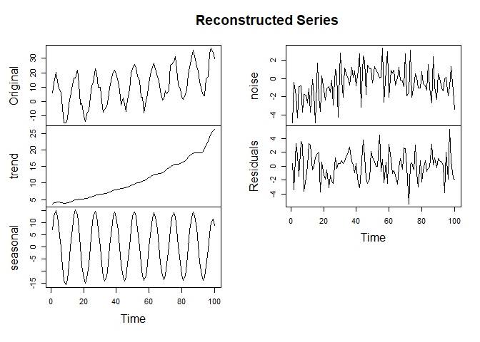<!-- -->

``` r
# Forecast
ssa_forecast <- forecast(ssa_decomp, groups = list(1:3), h = 24, 
                        method = "recurrent")
plot(ssa_forecast)
```

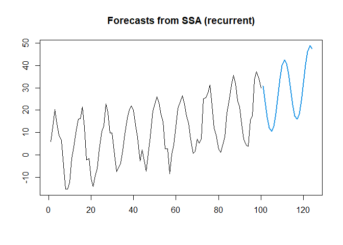<!-- -->

### 9. Centered Moving Average (CMA)

``` r
# Generate sample time series
set.seed(123)
y <- rnorm(100, 0, 1)
for(i in 2:100) {
  y[i] <- 0.7*y[i-1] + rnorm(1, 0, 1)
}
y <- y + 10 + 0.1*(1:100)
ts_data <- ts(y)

# Apply moving average
ma <- stats::filter(ts_data, filter = rep(1/12, 12), sides = 2)

# Plot results
plot(ts_data, main = "Moving Average Smoothing")
lines(ma, col = "red")

# Use for forecasting
forecast_values <- c(ma[length(ma)-11:0])
for(i in 1:12) {
  next_val <- mean(c(tail(ts_data, 11), forecast_values[1:i]))
  forecast_values <- c(forecast_values, next_val)
}

lines(101:112, forecast_values[13:24], col = "blue")
```

<!-- -->
