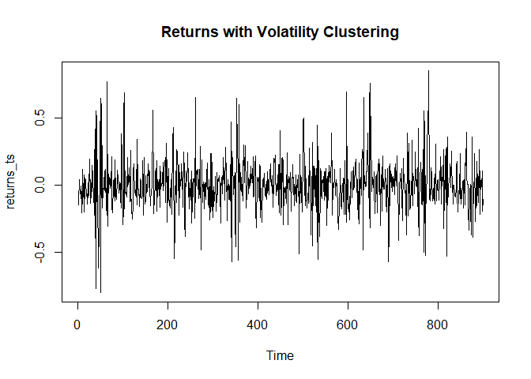
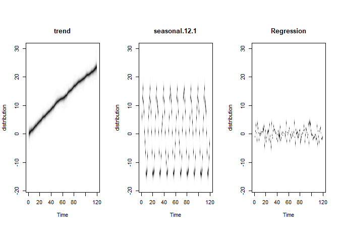
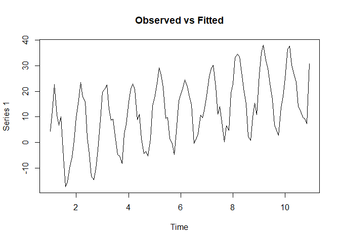

R Notebook
================

### **What are Stochastic Approaches in Time Series Forecasting?**

In time series forecasting, **stochastic models** assume that the future
values of a series are influenced by **random shocks (error terms)** and
some underlying systematic patterns (such as trend, seasonality, or
lagged relationships).

The key difference from **deterministic approaches** is that stochastic
models accept the **randomness** inherent in real-world data and attempt
to model it statistically.

The goal is to identify **lag relationships, autocorrelations, and
underlying structures** to make probabilistic forecasts.

### 1. Autoregressive Model (AR)

``` r
library(forecast)
```

    ## Warning: package 'forecast' was built under R version 4.4.3

    ## Registered S3 method overwritten by 'quantmod':
    ##   method            from
    ##   as.zoo.data.frame zoo

``` r
library(tseries)
```

    ## Warning: package 'tseries' was built under R version 4.4.3

``` r
# Generate sample AR(1) process
set.seed(123)
ar_sim <- arima.sim(list(ar = 0.7), n = 100)
plot(ar_sim, main = "Simulated AR(1) Process")
```

<!-- -->

``` r
# Fit AR model
ar_model <- Arima(ar_sim, order = c(1, 0, 0))
summary(ar_model)
```

    ## Series: ar_sim 
    ## ARIMA(1,0,0) with non-zero mean 
    ## 
    ## Coefficients:
    ##          ar1    mean
    ##       0.7127  0.0226
    ## s.e.  0.0685  0.2947
    ## 
    ## sigma^2 = 0.768:  log likelihood = -128.04
    ## AIC=262.08   AICc=262.33   BIC=269.9
    ## 
    ## Training set error measures:
    ##                        ME     RMSE       MAE      MPE     MAPE      MASE
    ## Training set -0.001587819 0.867547 0.6921088 46.25563 196.1183 0.9250022
    ##                       ACF1
    ## Training set -0.0003914258

``` r
# Diagnostic checks
checkresiduals(ar_model)
```

<!-- -->

    ## 
    ##  Ljung-Box test
    ## 
    ## data:  Residuals from ARIMA(1,0,0) with non-zero mean
    ## Q* = 4.2733, df = 9, p-value = 0.8925
    ## 
    ## Model df: 1.   Total lags used: 10

``` r
# Forecast
ar_forecast <- forecast(ar_model, h = 20)
plot(ar_forecast, main = "AR(1) Model Forecast")
```

<!-- -->

### 2. Moving Average (MA) Model

``` r
# Generate sample MA(1) process
set.seed(123)
ma_sim <- arima.sim(list(ma = 0.7), n = 100)
plot(ma_sim, main = "Simulated MA(1) Process")
```

<!-- -->

``` r
# Fit MA model
ma_model <- Arima(ma_sim, order = c(0, 0, 1))
summary(ma_model)
```

    ## Series: ma_sim 
    ## ARIMA(0,0,1) with non-zero mean 
    ## 
    ## Coefficients:
    ##          ma1    mean
    ##       0.8356  0.1389
    ## s.e.  0.0652  0.1640
    ## 
    ## sigma^2 = 0.8219:  log likelihood = -131.67
    ## AIC=269.35   AICc=269.6   BIC=277.16
    ## 
    ## Training set error measures:
    ##                       ME      RMSE       MAE      MPE     MAPE      MASE
    ## Training set 0.004893486 0.8974595 0.7213407 163.0787 462.5904 0.7748548
    ##                    ACF1
    ## Training set -0.1175695

``` r
# Diagnostic checks
checkresiduals(ma_model)
```

<!-- -->

    ## 
    ##  Ljung-Box test
    ## 
    ## data:  Residuals from ARIMA(0,0,1) with non-zero mean
    ## Q* = 3.9516, df = 9, p-value = 0.9146
    ## 
    ## Model df: 1.   Total lags used: 10

``` r
# Forecast
ma_forecast <- forecast(ma_model, h = 20)
plot(ma_forecast, main = "MA(1) Model Forecast")
```

<!-- -->

### 3. Autoregressive Moving Average (ARMA) Model

``` r
# Generate sample ARMA(1,1) process
set.seed(123)
arma_sim <- arima.sim(list(ar = 0.7, ma = 0.5), n = 100)
plot(arma_sim, main = "Simulated ARMA(1,1) Process")
```

<!-- -->

``` r
# Fit ARMA model
arma_model <- Arima(arma_sim, order = c(1, 0, 1))
summary(arma_model)
```

    ## Series: arma_sim 
    ## ARIMA(1,0,1) with non-zero mean 
    ## 
    ## Coefficients:
    ##          ar1     ma1     mean
    ##       0.6907  0.5672  -0.0038
    ## s.e.  0.0824  0.1137   0.4299
    ## 
    ## sigma^2 = 0.78:  log likelihood = -128.8
    ## AIC=265.6   AICc=266.02   BIC=276.02
    ## 
    ## Training set error measures:
    ##                         ME      RMSE       MAE       MPE     MAPE     MASE
    ## Training set -0.0008608567 0.8698524 0.6921998 -65.52788 229.9024 0.888662
    ##                     ACF1
    ## Training set -0.03335897

``` r
# Diagnostic checks
checkresiduals(arma_model)
```

<!-- -->

    ## 
    ##  Ljung-Box test
    ## 
    ## data:  Residuals from ARIMA(1,0,1) with non-zero mean
    ## Q* = 4.0535, df = 8, p-value = 0.8523
    ## 
    ## Model df: 2.   Total lags used: 10

``` r
# Forecast
arma_forecast <- forecast(arma_model, h = 20)
plot(arma_forecast, main = "ARMA(1,1) Model Forecast")
```

<!-- -->

### 4. Autoregressive Integrated Moving Average (ARMA) Model

``` r
# Generate non-stationary time series with trend
set.seed(123)
t <- 1:100
y <- 0.7*cumsum(rnorm(100)) + 0.3*t
ts_data <- ts(y)
plot(ts_data, main = "Non-stationary Time Series")
```

<!-- -->

``` r
# Check stationarity
adf.test(ts_data)
```

    ## 
    ##  Augmented Dickey-Fuller Test
    ## 
    ## data:  ts_data
    ## Dickey-Fuller = -1.8871, Lag order = 4, p-value = 0.6234
    ## alternative hypothesis: stationary

``` r
# Auto-select ARIMA model
auto_arima <- auto.arima(ts_data)
summary(auto_arima)
```

    ## Series: ts_data 
    ## ARIMA(0,1,0) with drift 
    ## 
    ## Coefficients:
    ##        drift
    ##       0.3679
    ## s.e.  0.0641
    ## 
    ## sigma^2 = 0.4103:  log likelihood = -95.88
    ## AIC=195.75   AICc=195.88   BIC=200.94
    ## 
    ## Training set error measures:
    ##                         ME     RMSE       MAE       MPE     MAPE      MASE
    ## Training set -4.602191e-06 0.634117 0.5059893 -4.639023 10.00244 0.8717583
    ##                     ACF1
    ## Training set -0.02843767

``` r
# Forecast using ARIMA
arima_forecast <- forecast(auto_arima, h = 20)
plot(arima_forecast, main = "ARIMA Model Forecast")
```

<!-- -->

### 5. Seasonal Autoregressive Integrated Moving Average (SARIMA) Model

``` r
# Generate seasonal time series
set.seed(123)
t <- 1:120
trend <- 0.2*t
seasonal <- 15*sin(2*pi*t/12)
y <- trend + seasonal + arima.sim(list(ar = 0.7), n = 120)
ts_data <- ts(y, frequency = 12)
plot(ts_data, main = "Seasonal Time Series")
```

<!-- -->

``` r
# Fit SARIMA model
sarima_model <- Arima(ts_data, order = c(1, 1, 0), 
                     seasonal = list(order = c(1, 1, 0), period = 12))
summary(sarima_model)
```

    ## Series: ts_data 
    ## ARIMA(1,1,0)(1,1,0)[12] 
    ## 
    ## Coefficients:
    ##           ar1     sar1
    ##       -0.0934  -0.5434
    ## s.e.   0.0980   0.0833
    ## 
    ## sigma^2 = 1.461:  log likelihood = -173.19
    ## AIC=352.38   AICc=352.62   BIC=360.4
    ## 
    ## Training set error measures:
    ##                        ME     RMSE       MAE      MPE     MAPE      MASE
    ## Training set 0.0009697003 1.130524 0.8242594 11.53735 26.55401 0.3089701
    ##                     ACF1
    ## Training set -0.02132766

``` r
# Alternative: Auto-select SARIMA model
auto_sarima <- auto.arima(ts_data, seasonal = TRUE)
summary(auto_sarima)
```

    ## Series: ts_data 
    ## ARIMA(1,0,0)(2,1,1)[12] with drift 
    ## 
    ## Coefficients:
    ##          ar1     sar1     sar2     sma1   drift
    ##       0.7103  -0.3047  -0.1886  -0.7935  0.1963
    ## s.e.  0.0677   0.1568   0.1432   0.2136  0.0064
    ## 
    ## sigma^2 = 0.826:  log likelihood = -151.1
    ## AIC=314.2   AICc=315.03   BIC=330.29
    ## 
    ## Training set error measures:
    ##                      ME      RMSE       MAE      MPE     MAPE      MASE
    ## Training set 0.06457965 0.8419885 0.6460224 8.715203 20.61431 0.2421587
    ##                     ACF1
    ## Training set -0.01254435

``` r
# Forecast
sarima_forecast <- forecast(auto_sarima, h = 24)
plot(sarima_forecast, main = "SARIMA Model Forecast")
```

<!-- -->

### 6. Autoregressive Conditional Heteroskedasticity (ARCH) Model

``` r
library(rugarch)
```

    ## Warning: package 'rugarch' was built under R version 4.4.3

    ## Loading required package: parallel

    ## 
    ## Attaching package: 'rugarch'

    ## The following object is masked from 'package:stats':
    ## 
    ##     sigma

``` r
# Generate returns with volatility clustering
set.seed(123)
returns <- rep(0, 1000)
sigma <- rep(0, 1000)
sigma[1] <- 0.1
for(i in 2:1000) {
  sigma[i] <- sqrt(0.01 + 0.9*returns[i-1]^2)
  returns[i] <- rnorm(1, 0, sigma[i])
}
returns <- returns[101:1000]
returns_ts <- ts(returns)
plot(returns_ts, main = "Returns with Volatility Clustering")
```

<!-- -->

``` r
# Specify and fit ARCH model
arch_spec <- ugarchspec(variance.model = list(model = "sGARCH", garchOrder = c(1, 0)),
                       mean.model = list(armaOrder = c(0, 0)))
arch_fit <- ugarchfit(arch_spec, returns_ts)
print(arch_fit)
```

    ## 
    ## *---------------------------------*
    ## *          GARCH Model Fit        *
    ## *---------------------------------*
    ## 
    ## Conditional Variance Dynamics    
    ## -----------------------------------
    ## GARCH Model  : sGARCH(1,0)
    ## Mean Model   : ARFIMA(0,0,0)
    ## Distribution : norm 
    ## 
    ## Optimal Parameters
    ## ------------------------------------
    ##         Estimate  Std. Error  t value Pr(>|t|)
    ## mu      0.000418    0.003678  0.11362  0.90954
    ## omega   0.010088    0.000831 12.14543  0.00000
    ## alpha1  0.891401    0.083098 10.72713  0.00000
    ## 
    ## Robust Standard Errors:
    ##         Estimate  Std. Error  t value Pr(>|t|)
    ## mu      0.000418    0.003543  0.11796   0.9061
    ## omega   0.010088    0.000676 14.91744   0.0000
    ## alpha1  0.891401    0.072663 12.26762   0.0000
    ## 
    ## LogLikelihood : 386.0682 
    ## 
    ## Information Criteria
    ## ------------------------------------
    ##                      
    ## Akaike       -0.85126
    ## Bayes        -0.83525
    ## Shibata      -0.85128
    ## Hannan-Quinn -0.84515
    ## 
    ## Weighted Ljung-Box Test on Standardized Residuals
    ## ------------------------------------
    ##                         statistic p-value
    ## Lag[1]                     0.7478  0.3872
    ## Lag[2*(p+q)+(p+q)-1][2]    0.9839  0.5035
    ## Lag[4*(p+q)+(p+q)-1][5]    2.5558  0.4941
    ## d.o.f=0
    ## H0 : No serial correlation
    ## 
    ## Weighted Ljung-Box Test on Standardized Squared Residuals
    ## ------------------------------------
    ##                         statistic p-value
    ## Lag[1]                    0.08037  0.7768
    ## Lag[2*(p+q)+(p+q)-1][2]   1.06801  0.4767
    ## Lag[4*(p+q)+(p+q)-1][5]   3.09798  0.3894
    ## d.o.f=1
    ## 
    ## Weighted ARCH LM Tests
    ## ------------------------------------
    ##             Statistic Shape Scale P-Value
    ## ARCH Lag[2]     1.967 0.500 2.000  0.1608
    ## ARCH Lag[4]     3.285 1.397 1.611  0.2255
    ## ARCH Lag[6]     4.610 2.222 1.500  0.2326
    ## 
    ## Nyblom stability test
    ## ------------------------------------
    ## Joint Statistic:  0.3537
    ## Individual Statistics:              
    ## mu     0.04954
    ## omega  0.23077
    ## alpha1 0.03609
    ## 
    ## Asymptotic Critical Values (10% 5% 1%)
    ## Joint Statistic:          0.846 1.01 1.35
    ## Individual Statistic:     0.35 0.47 0.75
    ## 
    ## Sign Bias Test
    ## ------------------------------------
    ##                    t-value   prob sig
    ## Sign Bias           0.1884 0.8506    
    ## Negative Sign Bias  0.7025 0.4826    
    ## Positive Sign Bias  0.9068 0.3648    
    ## Joint Effect        1.4276 0.6991    
    ## 
    ## 
    ## Adjusted Pearson Goodness-of-Fit Test:
    ## ------------------------------------
    ##   group statistic p-value(g-1)
    ## 1    20     11.91       0.8894
    ## 2    30     14.87       0.9860
    ## 3    40     26.84       0.9299
    ## 4    50     29.89       0.9858
    ## 
    ## 
    ## Elapsed time : 0.2083502

``` r
# Forecast volatility
arch_forecast <- ugarchforecast(arch_fit, n.ahead = 20)
plot(arch_forecast, which = 3)
```

<!-- -->

### 7. Generalized Autoregressive Conditional Heteroskedasticity (GARCH) Model

``` r
# Specify and fit GARCH(1,1) model
garch_spec <- ugarchspec(variance.model = list(model = "sGARCH", garchOrder = c(1, 1)),
                        mean.model = list(armaOrder = c(0, 0)))
garch_fit <- ugarchfit(garch_spec, returns_ts)
print(garch_fit)
```

    ## 
    ## *---------------------------------*
    ## *          GARCH Model Fit        *
    ## *---------------------------------*
    ## 
    ## Conditional Variance Dynamics    
    ## -----------------------------------
    ## GARCH Model  : sGARCH(1,1)
    ## Mean Model   : ARFIMA(0,0,0)
    ## Distribution : norm 
    ## 
    ## Optimal Parameters
    ## ------------------------------------
    ##         Estimate  Std. Error  t value Pr(>|t|)
    ## mu      0.000418    0.003681  0.11355   0.9096
    ## omega   0.010088    0.000989 10.20157   0.0000
    ## alpha1  0.891402    0.085190 10.46369   0.0000
    ## beta1   0.000000    0.024222  0.00000   1.0000
    ## 
    ## Robust Standard Errors:
    ##         Estimate  Std. Error  t value Pr(>|t|)
    ## mu      0.000418    0.003539  0.11811  0.90598
    ## omega   0.010088    0.000903 11.17347  0.00000
    ## alpha1  0.891402    0.076583 11.63975  0.00000
    ## beta1   0.000000    0.027897  0.00000  1.00000
    ## 
    ## LogLikelihood : 386.0682 
    ## 
    ## Information Criteria
    ## ------------------------------------
    ##                      
    ## Akaike       -0.84904
    ## Bayes        -0.82770
    ## Shibata      -0.84908
    ## Hannan-Quinn -0.84089
    ## 
    ## Weighted Ljung-Box Test on Standardized Residuals
    ## ------------------------------------
    ##                         statistic p-value
    ## Lag[1]                     0.7478  0.3872
    ## Lag[2*(p+q)+(p+q)-1][2]    0.9839  0.5035
    ## Lag[4*(p+q)+(p+q)-1][5]    2.5558  0.4941
    ## d.o.f=0
    ## H0 : No serial correlation
    ## 
    ## Weighted Ljung-Box Test on Standardized Squared Residuals
    ## ------------------------------------
    ##                         statistic p-value
    ## Lag[1]                    0.08038  0.7768
    ## Lag[2*(p+q)+(p+q)-1][5]   3.09799  0.3894
    ## Lag[4*(p+q)+(p+q)-1][9]   5.40309  0.3727
    ## d.o.f=2
    ## 
    ## Weighted ARCH LM Tests
    ## ------------------------------------
    ##             Statistic Shape Scale P-Value
    ## ARCH Lag[3]    0.3025 0.500 2.000  0.5823
    ## ARCH Lag[5]    3.1674 1.440 1.667  0.2664
    ## ARCH Lag[7]    4.0677 2.315 1.543  0.3369
    ## 
    ## Nyblom stability test
    ## ------------------------------------
    ## Joint Statistic:  0.4554
    ## Individual Statistics:              
    ## mu     0.04954
    ## omega  0.23077
    ## alpha1 0.03609
    ## beta1  0.06141
    ## 
    ## Asymptotic Critical Values (10% 5% 1%)
    ## Joint Statistic:          1.07 1.24 1.6
    ## Individual Statistic:     0.35 0.47 0.75
    ## 
    ## Sign Bias Test
    ## ------------------------------------
    ##                    t-value   prob sig
    ## Sign Bias           0.1884 0.8506    
    ## Negative Sign Bias  0.7025 0.4826    
    ## Positive Sign Bias  0.9068 0.3648    
    ## Joint Effect        1.4276 0.6991    
    ## 
    ## 
    ## Adjusted Pearson Goodness-of-Fit Test:
    ## ------------------------------------
    ##   group statistic p-value(g-1)
    ## 1    20     11.91       0.8894
    ## 2    30     14.87       0.9860
    ## 3    40     26.84       0.9299
    ## 4    50     29.89       0.9858
    ## 
    ## 
    ## Elapsed time : 0.1046801

``` r
# Forecast volatility
garch_forecast <- ugarchforecast(garch_fit, n.ahead = 20)
plot(garch_forecast, which = 3)
```

<!-- -->

#### ARMA-GARCH Model (Combining Mean + Volatility)

``` r
# Specify and fit ARMA(1,1)-GARCH(1,1) model
armagarch_spec <- ugarchspec(variance.model = list(model = "sGARCH", garchOrder = c(1, 1)),
                            mean.model = list(armaOrder = c(1, 1)))
armagarch_fit <- ugarchfit(armagarch_spec, returns_ts)
print(armagarch_fit)
```

    ## 
    ## *---------------------------------*
    ## *          GARCH Model Fit        *
    ## *---------------------------------*
    ## 
    ## Conditional Variance Dynamics    
    ## -----------------------------------
    ## GARCH Model  : sGARCH(1,1)
    ## Mean Model   : ARFIMA(1,0,1)
    ## Distribution : norm 
    ## 
    ## Optimal Parameters
    ## ------------------------------------
    ##         Estimate  Std. Error   t value Pr(>|t|)
    ## mu      0.000502    0.003462  0.144925 0.884770
    ## ar1     0.537661    0.255624  2.103327 0.035437
    ## ma1    -0.568904    0.244117 -2.330459 0.019782
    ## omega   0.010040    0.000950 10.567606 0.000000
    ## alpha1  0.895075    0.084152 10.636423 0.000000
    ## beta1   0.000000    0.018835  0.000001 0.999999
    ## 
    ## Robust Standard Errors:
    ##         Estimate  Std. Error   t value Pr(>|t|)
    ## mu      0.000502    0.003467  0.144703 0.884946
    ## ar1     0.537661    0.153896  3.493653 0.000476
    ## ma1    -0.568904    0.145414 -3.912318 0.000091
    ## omega   0.010040    0.000843 11.909092 0.000000
    ## alpha1  0.895075    0.075220 11.899488 0.000000
    ## beta1   0.000000    0.018508  0.000001 0.999999
    ## 
    ## LogLikelihood : 387.2214 
    ## 
    ## Information Criteria
    ## ------------------------------------
    ##                      
    ## Akaike       -0.84716
    ## Bayes        -0.81514
    ## Shibata      -0.84725
    ## Hannan-Quinn -0.83493
    ## 
    ## Weighted Ljung-Box Test on Standardized Residuals
    ## ------------------------------------
    ##                         statistic p-value
    ## Lag[1]                    0.07558  0.7834
    ## Lag[2*(p+q)+(p+q)-1][5]   1.05820  1.0000
    ## Lag[4*(p+q)+(p+q)-1][9]   1.87022  0.9893
    ## d.o.f=2
    ## H0 : No serial correlation
    ## 
    ## Weighted Ljung-Box Test on Standardized Squared Residuals
    ## ------------------------------------
    ##                         statistic p-value
    ## Lag[1]                     0.1508  0.6977
    ## Lag[2*(p+q)+(p+q)-1][5]    2.5125  0.5032
    ## Lag[4*(p+q)+(p+q)-1][9]    4.7685  0.4642
    ## d.o.f=2
    ## 
    ## Weighted ARCH LM Tests
    ## ------------------------------------
    ##             Statistic Shape Scale P-Value
    ## ARCH Lag[3]    0.2442 0.500 2.000  0.6212
    ## ARCH Lag[5]    3.0012 1.440 1.667  0.2896
    ## ARCH Lag[7]    3.9088 2.315 1.543  0.3599
    ## 
    ## Nyblom stability test
    ## ------------------------------------
    ## Joint Statistic:  0.957
    ## Individual Statistics:              
    ## mu     0.05231
    ## ar1    0.23875
    ## ma1    0.22602
    ## omega  0.23585
    ## alpha1 0.04854
    ## beta1  0.04241
    ## 
    ## Asymptotic Critical Values (10% 5% 1%)
    ## Joint Statistic:          1.49 1.68 2.12
    ## Individual Statistic:     0.35 0.47 0.75
    ## 
    ## Sign Bias Test
    ## ------------------------------------
    ##                    t-value   prob sig
    ## Sign Bias           0.0493 0.9607    
    ## Negative Sign Bias  0.6308 0.5283    
    ## Positive Sign Bias  0.9943 0.3204    
    ## Joint Effect        1.4423 0.6957    
    ## 
    ## 
    ## Adjusted Pearson Goodness-of-Fit Test:
    ## ------------------------------------
    ##   group statistic p-value(g-1)
    ## 1    20     9.867       0.9562
    ## 2    30    15.800       0.9777
    ## 3    40    22.489       0.9842
    ## 4    50    29.667       0.9869
    ## 
    ## 
    ## Elapsed time : 0.1685028

``` r
# Forecast
armagarch_forecast <- ugarchforecast(armagarch_fit, n.ahead = 20)
plot(armagarch_forecast, which = 1)  # Conditional mean forecast
```

<!-- -->

``` r
plot(armagarch_forecast, which = 3)  # Conditional sigma forecast
```

<!-- -->

### 8. Bayesian Structural Time Series (BSTS) model

``` r
library(bsts)
```

    ## Warning: package 'bsts' was built under R version 4.4.3

    ## Loading required package: BoomSpikeSlab

    ## Warning: package 'BoomSpikeSlab' was built under R version 4.4.3

    ## Loading required package: Boom

    ## Warning: package 'Boom' was built under R version 4.4.3

    ## 
    ## Attaching package: 'Boom'

    ## The following object is masked from 'package:stats':
    ## 
    ##     rWishart

    ## 
    ## Attaching package: 'BoomSpikeSlab'

    ## The following object is masked from 'package:stats':
    ## 
    ##     knots

    ## Loading required package: zoo

    ## Warning: package 'zoo' was built under R version 4.4.3

    ## 
    ## Attaching package: 'zoo'

    ## The following objects are masked from 'package:base':
    ## 
    ##     as.Date, as.Date.numeric

    ## Loading required package: xts

    ## Warning: package 'xts' was built under R version 4.4.3

    ## 
    ## Attaching package: 'bsts'

    ## The following object is masked from 'package:BoomSpikeSlab':
    ## 
    ##     SuggestBurn

``` r
# Generate data with regression component
set.seed(123)
t <- 1:120
trend <- 0.2*t
seasonal <- 15*sin(2*pi*t/12)
X <- matrix(rnorm(120*2), ncol = 2)  # Two predictor variables
beta <- c(1.5, -0.8)
y <- trend + seasonal + X %*% beta + rnorm(120, 0, 3)
ts_data <- ts(y, frequency = 12)

# Build and fit the model
ss <- AddLocalLinearTrend(list(), ts_data)
ss <- AddSeasonal(ss, ts_data, nseasons = 12)
bsts_model <- bsts(ts_data ~ X, state.specification = ss, 
                  niter = 1000, ping = 0)

# Plot components
plot(bsts_model, "components")
```

<!-- -->

``` r
# Plot fitted values vs actual
plot(ts_data, main = "Observed vs Fitted")
lines(as.numeric(fitted(bsts_model)), col = "red")
```

<!-- -->

``` r
# Forecast
horizon <- 24
pred <- predict(bsts_model, horizon = horizon, newdata = matrix(rnorm(horizon*2), ncol = 2))
plot(pred, main = "BSTS Forecast")
```

<!-- -->

### 9. Bayesian Vector Autoregression (BVAR) model

``` r
library(BVAR)
```

    ## Warning: package 'BVAR' was built under R version 4.4.3

``` r
# Generate multivariate time series
set.seed(123)
n <- 100
y1 <- arima.sim(list(ar = c(0.8, -0.4)), n = n)
y2 <- 0.5*y1 + arima.sim(list(ar = 0.5), n = n)
y <- cbind(y1, y2)
colnames(y) <- c("Variable1", "Variable2")

# Fit BVAR model
bvar_model <- bvar(y, lags = 2)
```

    ## Optimisation concluded.
    ## Posterior marginal likelihood: -301.549
    ## Hyperparameters: lambda = 0.34319
    ##   |                                                                              |                                                                      |   0%  |                                                                              |                                                                      |   1%  |                                                                              |=                                                                     |   1%  |                                                                              |=                                                                     |   2%  |                                                                              |==                                                                    |   2%  |                                                                              |==                                                                    |   3%  |                                                                              |==                                                                    |   4%  |                                                                              |===                                                                   |   4%  |                                                                              |===                                                                   |   5%  |                                                                              |====                                                                  |   5%  |                                                                              |====                                                                  |   6%  |                                                                              |=====                                                                 |   6%  |                                                                              |=====                                                                 |   7%  |                                                                              |=====                                                                 |   8%  |                                                                              |======                                                                |   8%  |                                                                              |======                                                                |   9%  |                                                                              |=======                                                               |   9%  |                                                                              |=======                                                               |  10%  |                                                                              |=======                                                               |  11%  |                                                                              |========                                                              |  11%  |                                                                              |========                                                              |  12%  |                                                                              |=========                                                             |  12%  |                                                                              |=========                                                             |  13%  |                                                                              |=========                                                             |  14%  |                                                                              |==========                                                            |  14%  |                                                                              |==========                                                            |  15%  |                                                                              |===========                                                           |  15%  |                                                                              |===========                                                           |  16%  |                                                                              |============                                                          |  16%  |                                                                              |============                                                          |  17%  |                                                                              |============                                                          |  18%  |                                                                              |=============                                                         |  18%  |                                                                              |=============                                                         |  19%  |                                                                              |==============                                                        |  19%  |                                                                              |==============                                                        |  20%  |                                                                              |==============                                                        |  21%  |                                                                              |===============                                                       |  21%  |                                                                              |===============                                                       |  22%  |                                                                              |================                                                      |  22%  |                                                                              |================                                                      |  23%  |                                                                              |================                                                      |  24%  |                                                                              |=================                                                     |  24%  |                                                                              |=================                                                     |  25%  |                                                                              |==================                                                    |  25%  |                                                                              |==================                                                    |  26%  |                                                                              |===================                                                   |  26%  |                                                                              |===================                                                   |  27%  |                                                                              |===================                                                   |  28%  |                                                                              |====================                                                  |  28%  |                                                                              |====================                                                  |  29%  |                                                                              |=====================                                                 |  29%  |                                                                              |=====================                                                 |  30%  |                                                                              |=====================                                                 |  31%  |                                                                              |======================                                                |  31%  |                                                                              |======================                                                |  32%  |                                                                              |=======================                                               |  32%  |                                                                              |=======================                                               |  33%  |                                                                              |=======================                                               |  34%  |                                                                              |========================                                              |  34%  |                                                                              |========================                                              |  35%  |                                                                              |=========================                                             |  35%  |                                                                              |=========================                                             |  36%  |                                                                              |==========================                                            |  36%  |                                                                              |==========================                                            |  37%  |                                                                              |==========================                                            |  38%  |                                                                              |===========================                                           |  38%  |                                                                              |===========================                                           |  39%  |                                                                              |============================                                          |  39%  |                                                                              |============================                                          |  40%  |                                                                              |============================                                          |  41%  |                                                                              |=============================                                         |  41%  |                                                                              |=============================                                         |  42%  |                                                                              |==============================                                        |  42%  |                                                                              |==============================                                        |  43%  |                                                                              |==============================                                        |  44%  |                                                                              |===============================                                       |  44%  |                                                                              |===============================                                       |  45%  |                                                                              |================================                                      |  45%  |                                                                              |================================                                      |  46%  |                                                                              |=================================                                     |  46%  |                                                                              |=================================                                     |  47%  |                                                                              |=================================                                     |  48%  |                                                                              |==================================                                    |  48%  |                                                                              |==================================                                    |  49%  |                                                                              |===================================                                   |  49%  |                                                                              |===================================                                   |  50%  |                                                                              |===================================                                   |  51%  |                                                                              |====================================                                  |  51%  |                                                                              |====================================                                  |  52%  |                                                                              |=====================================                                 |  52%  |                                                                              |=====================================                                 |  53%  |                                                                              |=====================================                                 |  54%  |                                                                              |======================================                                |  54%  |                                                                              |======================================                                |  55%  |                                                                              |=======================================                               |  55%  |                                                                              |=======================================                               |  56%  |                                                                              |========================================                              |  56%  |                                                                              |========================================                              |  57%  |                                                                              |========================================                              |  58%  |                                                                              |=========================================                             |  58%  |                                                                              |=========================================                             |  59%  |                                                                              |==========================================                            |  59%  |                                                                              |==========================================                            |  60%  |                                                                              |==========================================                            |  61%  |                                                                              |===========================================                           |  61%  |                                                                              |===========================================                           |  62%  |                                                                              |============================================                          |  62%  |                                                                              |============================================                          |  63%  |                                                                              |============================================                          |  64%  |                                                                              |=============================================                         |  64%  |                                                                              |=============================================                         |  65%  |                                                                              |==============================================                        |  65%  |                                                                              |==============================================                        |  66%  |                                                                              |===============================================                       |  66%  |                                                                              |===============================================                       |  67%  |                                                                              |===============================================                       |  68%  |                                                                              |================================================                      |  68%  |                                                                              |================================================                      |  69%  |                                                                              |=================================================                     |  69%  |                                                                              |=================================================                     |  70%  |                                                                              |=================================================                     |  71%  |                                                                              |==================================================                    |  71%  |                                                                              |==================================================                    |  72%  |                                                                              |===================================================                   |  72%  |                                                                              |===================================================                   |  73%  |                                                                              |===================================================                   |  74%  |                                                                              |====================================================                  |  74%  |                                                                              |====================================================                  |  75%  |                                                                              |=====================================================                 |  75%  |                                                                              |=====================================================                 |  76%  |                                                                              |======================================================                |  76%  |                                                                              |======================================================                |  77%  |                                                                              |======================================================                |  78%  |                                                                              |=======================================================               |  78%  |                                                                              |=======================================================               |  79%  |                                                                              |========================================================              |  79%  |                                                                              |========================================================              |  80%  |                                                                              |========================================================              |  81%  |                                                                              |=========================================================             |  81%  |                                                                              |=========================================================             |  82%  |                                                                              |==========================================================            |  82%  |                                                                              |==========================================================            |  83%  |                                                                              |==========================================================            |  84%  |                                                                              |===========================================================           |  84%  |                                                                              |===========================================================           |  85%  |                                                                              |============================================================          |  85%  |                                                                              |============================================================          |  86%  |                                                                              |=============================================================         |  86%  |                                                                              |=============================================================         |  87%  |                                                                              |=============================================================         |  88%  |                                                                              |==============================================================        |  88%  |                                                                              |==============================================================        |  89%  |                                                                              |===============================================================       |  89%  |                                                                              |===============================================================       |  90%  |                                                                              |===============================================================       |  91%  |                                                                              |================================================================      |  91%  |                                                                              |================================================================      |  92%  |                                                                              |=================================================================     |  92%  |                                                                              |=================================================================     |  93%  |                                                                              |=================================================================     |  94%  |                                                                              |==================================================================    |  94%  |                                                                              |==================================================================    |  95%  |                                                                              |===================================================================   |  95%  |                                                                              |===================================================================   |  96%  |                                                                              |====================================================================  |  96%  |                                                                              |====================================================================  |  97%  |                                                                              |====================================================================  |  98%  |                                                                              |===================================================================== |  98%  |                                                                              |===================================================================== |  99%  |                                                                              |======================================================================|  99%  |                                                                              |======================================================================| 100%
    ## Finished MCMC after 3.71 secs.

``` r
# Plot posterior distributions
plot(bvar_model)
```

<!-- -->

``` r
# Forecast
bvar_forecast <- predict(bvar_model, horizon = 12)
plot(bvar_forecast)
```

<!-- -->

``` r
# Impulse response functions
irf <- irf(bvar_model)
plot(irf)
```

<!-- -->

### 10. Autoregressive Fractionally Integrated Moving Average (ARFIMA) Model

``` r
library(arfima)
```

    ## Loading required package: ltsa

    ## Note that the arfima package has new defaults starting with
    ## 1.4-0: type arfimachanges() for a list, as well as some other notes.
    ## NOTE: some of these are quite important!

    ## 
    ## Attaching package: 'arfima'

    ## The following object is masked from 'package:forecast':
    ## 
    ##     arfima

    ## The following object is masked from 'package:stats':
    ## 
    ##     BIC

``` r
# Generate fractionally integrated data
set.seed(123)
sim_arfima <- arfima.sim(n = 500, model = list(phi = 0.7, dfrac = 0.3))
plot(sim_arfima, main = "Simulated ARFIMA Process")
```

<!-- -->

``` r
# Fit ARFIMA model
arfima_model <- arfima(sim_arfima, order = c(1, 0, 0))
```

    ## Note: only one starting point.  Only one mode can be found -- this is now the default behavior.
    ## Beginning the fits with 1 starting values.

``` r
summary(arfima_model)
```

    ## 
    ## Call:
    ##  
    ## arfima(z = sim_arfima, order = c(1, 0, 0))
    ## 
    ## 
    ## Mode 1 Coefficients:
    ##              Estimate Std. Error Th. Std. Err. z-value   Pr(>|z|)    
    ## phi(1)      0.6961905  0.1083974     0.1117139 6.42257 1.3399e-10 ***
    ## d.f         0.2221222  0.1217785     0.1213260 1.82399   0.068154 .  
    ## Fitted mean 0.0570043  0.5681549            NA 0.10033   0.920080    
    ## ---
    ## Signif. codes:  0 '***' 0.001 '**' 0.01 '*' 0.05 '.' 0.1 ' ' 1
    ## sigma^2 estimated as 0.943014; Log-likelihood = 15.3586; AIC = -22.7171; BIC = -5.8587
    ## 
    ## Numerical Correlations of Coefficients:
    ##             phi(1) d.f   Fitted mean
    ## phi(1)       1.00  -0.96 -0.07      
    ## d.f         -0.96   1.00  0.07      
    ## Fitted mean -0.07   0.07  1.00      
    ## 
    ## Theoretical Correlations of Coefficients:
    ##        phi(1) d.f  
    ## phi(1)  1.00  -0.96
    ## d.f    -0.96   1.00
    ## 
    ## Expected Fisher Information Matrix of Coefficients:
    ##        phi(1) d.f 
    ## phi(1) 1.93   1.71
    ## d.f    1.71   1.64

``` r
# Forecast
arfima_forecast <- predict(arfima_model, n.ahead = 50)
plot(arfima_forecast, main = "ARFIMA Forecast")
```

<!-- -->
