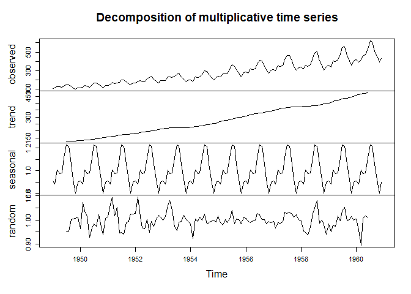

``` r
# libraries
library(ggplot2)
library(tseries)
```

    ## Registered S3 method overwritten by 'quantmod':
    ##   method            from
    ##   as.zoo.data.frame zoo

``` r
set.seed(123)

# Non-stationary time series (Linear Trend + Noise)
t <- 1:100  # Time index
epsilon <- rnorm(100, mean = 0, sd = 5)  # Random noise
Y <- 3 * t + epsilon

# Convert to time series object
Y_ts <- ts(Y)

plot(Y_ts, type = "l", col = "blue", main = "Original Non-Stationary Series", ylab = "Y_t", xlab = "Time")
```

<!-- -->

``` r
# Apply first-order differencing
Y_diff <- diff(Y_ts)

mean_Y_diff <- mean(Y_diff)

print(paste("Mean of Differenced Series:", mean_Y_diff))
```

    ## [1] "Mean of Differenced Series: 2.97646741142654"

``` r
# Plot differenced series
plot(Y_diff, type = "l", col = "red", main = "First-Order Differenced Series", ylab = "ΔY_t", xlab = "Time")
```

<!-- -->

``` r
library(forecast)

acf(Y_ts, main = "ACF of Original Series (Y_ts)")
```

<!-- -->

``` r
pacf(Y_ts, main = "PACF of Original Series (Y_ts)")
```

<!-- -->

``` r
acf(Y_diff, main = "ACF of Differenced Series (Y_diff)")
```

<!-- -->

``` r
pacf(Y_diff, main = "PACF of Differenced Series (Y_diff)")
```

<!-- -->

``` r
library(forecast)

# Simulate an AR(2) process
set.seed(123)
ar_model <- arima.sim(model = list(ar = c(0.5, -0.3)), n = 100)

# Plot the simulated AR(2) series
plot.ts(ar_model, main="Simulated AR(2) Time Series")
```

<!-- -->

``` r
set.seed(123)
ma_model <- arima.sim(model = list(ma = c(0.6, -0.4)), n = 100)

# Plot the simulated MA(2) series
plot.ts(ma_model, main="Simulated MA(2) Time Series")
```

<!-- -->

``` r
library(stats)

# Load the nottem dataset (Monthly air temperature in Nottingham)
data("nottem")

# Convert to time series object
ts_data <- ts(nottem, frequency = 12, start = c(1920, 1))

# Plot the original time series
plot.ts(ts_data, main="Nottingham Monthly Average Air Temperature",
        ylab="Temperature (°C)", col="blue")
```

<!-- -->

``` r
# Decompose using an additive model
additive_decomp <- decompose(ts_data, type="additive")

# Plot decomposition
plot(additive_decomp)
```

<!-- -->

``` r
# Load necessary package
library(stats)

# Load the AirPassengers dataset
data("AirPassengers")

# Convert to time series object
ts_data <- ts(AirPassengers, frequency = 12, start = c(1949, 1))

# Plot the original time series
plot.ts(ts_data, main="Monthly Airline Passengers",
        ylab="Number of Passengers", col="blue")
```

<!-- -->

``` r
# Decompose using a multiplicative model
multiplicative_decomp <- decompose(ts_data, type="multiplicative")

# Plot decomposition
plot(multiplicative_decomp)
```

<!-- -->
