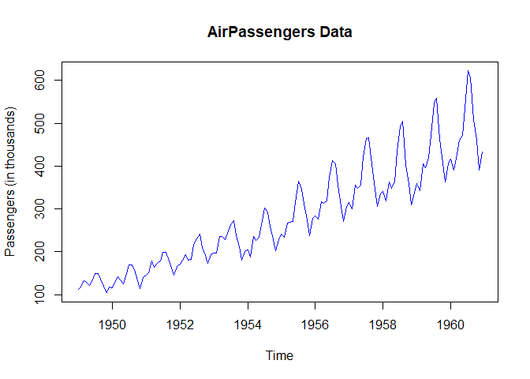
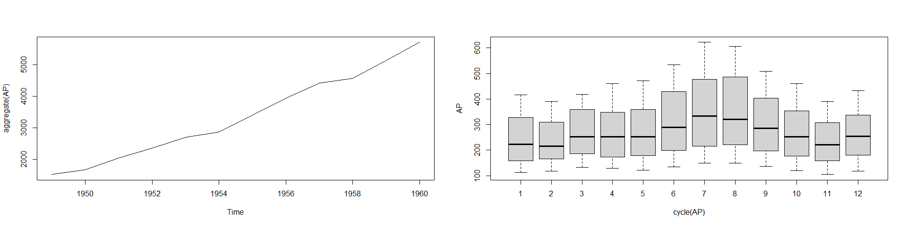
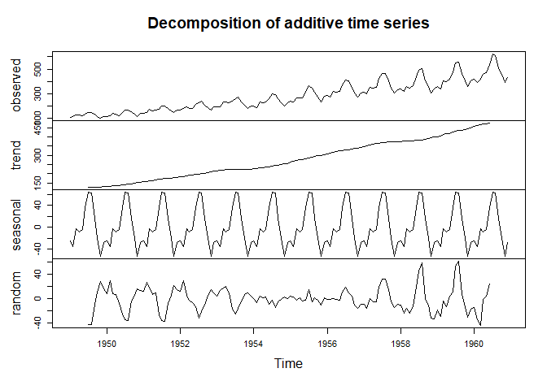
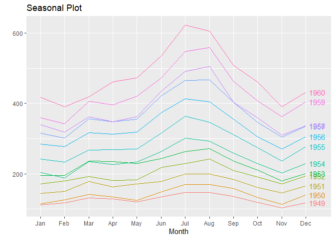
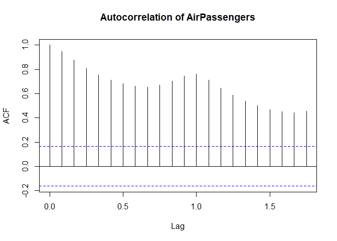
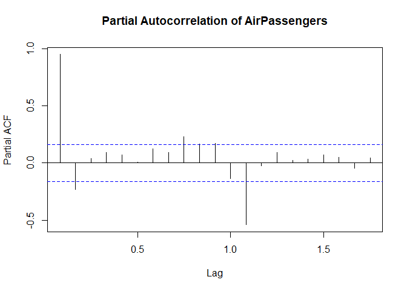
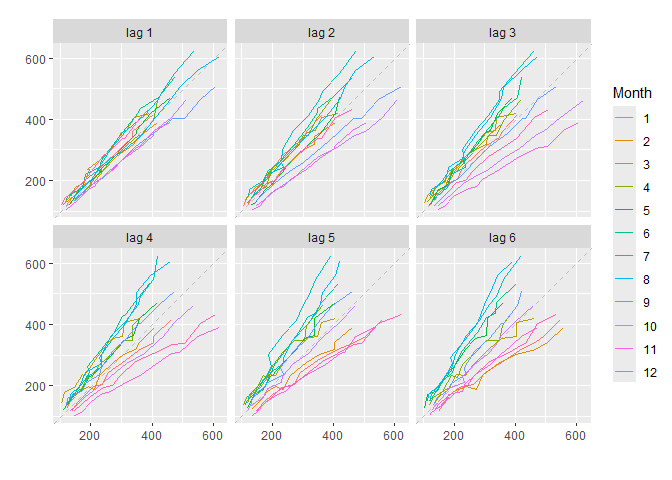

**About the Dataset:**

The number of international passenger bookings (in thousands) per month
on an airline (Pan Am) in the United States were obtained from the
Federal Aviation Administration for the period 1949–1960 (Brown, 1963).
The company used the data to predict future demand before ordering new
aircraft and training aircrew. The data are available as a time series
in R and illustrate several important concepts that arise in an
exploratory time series analysis.

``` r
data(AirPassengers) # loads built-in data-set
AP <- AirPassengers
AP
```

    ##      Jan Feb Mar Apr May Jun Jul Aug Sep Oct Nov Dec
    ## 1949 112 118 132 129 121 135 148 148 136 119 104 118
    ## 1950 115 126 141 135 125 149 170 170 158 133 114 140
    ## 1951 145 150 178 163 172 178 199 199 184 162 146 166
    ## 1952 171 180 193 181 183 218 230 242 209 191 172 194
    ## 1953 196 196 236 235 229 243 264 272 237 211 180 201
    ## 1954 204 188 235 227 234 264 302 293 259 229 203 229
    ## 1955 242 233 267 269 270 315 364 347 312 274 237 278
    ## 1956 284 277 317 313 318 374 413 405 355 306 271 306
    ## 1957 315 301 356 348 355 422 465 467 404 347 305 336
    ## 1958 340 318 362 348 363 435 491 505 404 359 310 337
    ## 1959 360 342 406 396 420 472 548 559 463 407 362 405
    ## 1960 417 391 419 461 472 535 622 606 508 461 390 432

class(dataset) gives the class of the dataset.

``` r
class(AP)
```

    ## [1] "ts"

``` r
start(AP)
```

    ## [1] 1949    1

``` r
end(AP)
```

    ## [1] 1960   12

``` r
frequency(AP)
```

    ## [1] 12

To analyse time series, it makes sense to put our data into objects of
class ts. This can be achieved using a function also called ts, but this
was not necessary for the airline data, which were already stored in
this form

``` r
plot(AP,  main="AirPassengers Data", ylab="Passengers (in thousands)", col="blue")
```

<!-- -->

To get a clearer view of the trend, the seasonal effect can be removed
by aggregating the data to the annual level, which can be achieved in R
using the aggregate function. A summary of the values for each season
can be viewed using a boxplot, with the cycle function being used to
extract the seasons for each item of data. The plots can be put in a
single graphics window using the layout function.

``` r
layout(matrix(c(1,2), ncol=2))
plot(aggregate(AP))
boxplot(AP ~ cycle(AP))
```

<!-- -->

In R, the function decompose estimates trends and seasonal effects using
a moving average method. Nesting the function within plot (e.g., using
plot(decompose())) produces a single figure showing the original series
xt and the decomposed series mt, st, and zt.

where, at time t, xt is the observed series, mt is the trend, st is the
seasonal effect, and zt is an error term.

``` r
decomposed <- decompose(AirPassengers)
plot(decomposed)
```

<!-- -->

**Seasonal Plot:** A seasonal plot is similar to a time plot except that
the data are plotted against the individual “seasons” in which the data
were observed.

here we are using ggseasonplot() which is found in forecast package.
Before running this code, install the package with
{install.packages(“forecast”)}

``` r
library(forecast)
```

    ## Registered S3 method overwritten by 'quantmod':
    ##   method            from
    ##   as.zoo.data.frame zoo

``` r
ggseasonplot(AirPassengers, year.labels=TRUE, main="Seasonal Plot")
```

<!-- -->

**ACF** (Autocorrelation Function): Measures the correlation between a
time series and its lagged values. It shows both direct and indirect
correlations.

If a time series has a strong trend, ACF will decay slowly.

Helps determine if the series is stationary or non-stationary.

``` r
acf(AirPassengers, main="Autocorrelation of AirPassengers")
```

<!-- -->

**PACF** (Partial Autocorrelation Function): Measures the direct
correlation between a time series and its lagged values, removing the
effect of intermediate lags.

Helps identify the order of autoregressive (AR) terms in an ARMA/ARIMA
model.

If a series follows an AR process, PACF cuts off after a certain lag.

``` r
pacf(AirPassengers, main="Partial Autocorrelation of AirPassengers")
```

<!-- -->

**Lag Plot:** Lag plot will plot time series against lagged versions of
themselves.

Helps visualising ‘auto-dependence’ even when auto-correlations vanish.

again the lag plot can be plotted using gglagplot() which is found in
package called ggfortify.

``` r
library(ggfortify)
```

    ## Loading required package: ggplot2

    ## Registered S3 methods overwritten by 'ggfortify':
    ##   method                 from    
    ##   autoplot.Arima         forecast
    ##   autoplot.acf           forecast
    ##   autoplot.ar            forecast
    ##   autoplot.bats          forecast
    ##   autoplot.decomposed.ts forecast
    ##   autoplot.ets           forecast
    ##   autoplot.forecast      forecast
    ##   autoplot.stl           forecast
    ##   autoplot.ts            forecast
    ##   fitted.ar              forecast
    ##   fortify.ts             forecast
    ##   residuals.ar           forecast

``` r
gglagplot(AirPassengers, lags=6)
```

<!-- -->
