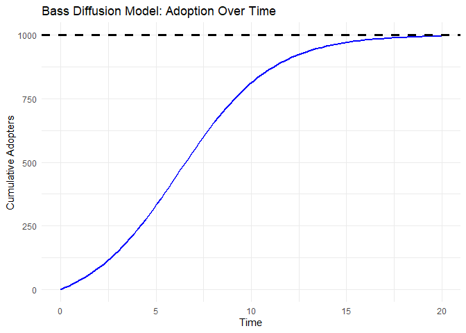
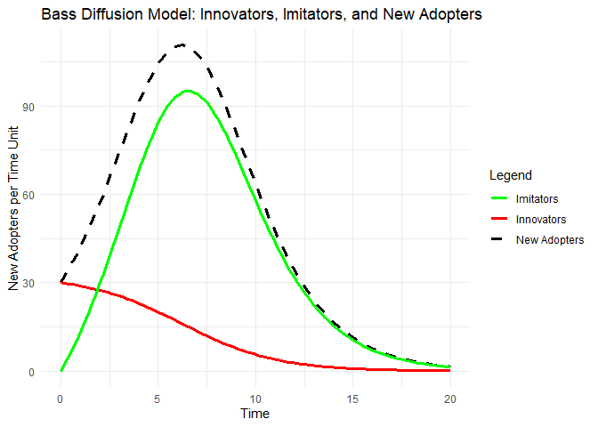

``` r
library(ggplot2)

# Bass model parameters
M <- 1000  # Total market potential
p <- 0.03  # Coefficient of innovation
q <- 0.38  # Coefficient of imitation

# Time range
t <- seq(0, 20, length.out = 100)  # 20 time periods
```


``` r
# Bass model equation for cumulative adoption
bass_diffusion <- function(t, M, p, q) {
  exp_term <- exp(-(p + q) * t)
  return(M * (1 - exp_term) / (1 + (q / p) * exp_term))
}

# Compute adoption over time
N_t <- bass_diffusion(t, M, p, q)

# Create a data frame for plotting
df <- data.frame(Time = t, Cumulative_Adopters = N_t)
df
```

```
##           Time Cumulative_Adopters
## 1    0.0000000            0.000000
## 2    0.2020202            6.279002
## 3    0.4040404           13.011474
## 4    0.6060606           20.222704
## 5    0.8080808           27.938184
## 6    1.0101010           36.183397
## 7    1.2121212           44.983560
## 8    1.4141414           54.363336
## 9    1.6161616           64.346508
## 10   1.8181818           74.955611
## 11   2.0202020           86.211535
## 12   2.2222222           98.133090
## 13   2.4242424          110.736544
## 14   2.6262626          124.035135
## 15   2.8282828          138.038581
## 16   3.0303030          152.752567
## 17   3.2323232          168.178259
## 18   3.4343434          184.311826
## 19   3.6363636          201.144012
## 20   3.8383838          218.659749
## 21   4.0404040          236.837854
## 22   4.2424242          255.650808
## 23   4.4444444          275.064642
## 24   4.6464646          295.038943
## 25   4.8484848          315.526988
## 26   5.0505051          336.476015
## 27   5.2525253          357.827644
## 28   5.4545455          379.518423
## 29   5.6565657          401.480515
## 30   5.8585859          423.642498
## 31   6.0606061          445.930268
## 32   6.2626263          468.268013
## 33   6.4646465          490.579238
## 34   6.6666667          512.787809
## 35   6.8686869          534.818993
## 36   7.0707071          556.600444
## 37   7.2727273          578.063135
## 38   7.4747475          599.142190
## 39   7.6767677          619.777605
## 40   7.8787879          639.914845
## 41   8.0808081          659.505299
## 42   8.2828283          678.506594
## 43   8.4848485          696.882777
## 44   8.6868687          714.604358
## 45   8.8888889          731.648227
## 46   9.0909091          747.997468
## 47   9.2929293          763.641079
## 48   9.4949495          778.573608
## 49   9.6969697          792.794735
## 50   9.8989899          806.308811
## 51  10.1010101          819.124368
## 52  10.3030303          831.253618
## 53  10.5050505          842.711953
## 54  10.7070707          853.517451
## 55  10.9090909          863.690411
## 56  11.1111111          873.252908
## 57  11.3131313          882.228382
## 58  11.5151515          890.641263
## 59  11.7171717          898.516631
## 60  11.9191919          905.879915
## 61  12.1212121          912.756630
## 62  12.3232323          919.172145
## 63  12.5252525          925.151498
## 64  12.7272727          930.719222
## 65  12.9292929          935.899222
## 66  13.1313131          940.714664
## 67  13.3333333          945.187893
## 68  13.5353535          949.340375
## 69  13.7373737          953.192650
## 70  13.9393939          956.764305
## 71  14.1414141          960.073966
## 72  14.3434343          963.139291
## 73  14.5454545          965.976983
## 74  14.7474747          968.602798
## 75  14.9494949          971.031578
## 76  15.1515152          973.277269
## 77  15.3535354          975.352955
## 78  15.5555556          977.270896
## 79  15.7575758          979.042556
## 80  15.9595960          980.678647
## 81  16.1616162          982.189164
## 82  16.3636364          983.583419
## 83  16.5656566          984.870087
## 84  16.7676768          986.057234
## 85  16.9696970          987.152358
## 86  17.1717172          988.162423
## 87  17.3737374          989.093890
## 88  17.5757576          989.952752
## 89  17.7777778          990.744565
## 90  17.9797980          991.474473
## 91  18.1818182          992.147242
## 92  18.3838384          992.767279
## 93  18.5858586          993.338665
## 94  18.7878788          993.865169
## 95  18.9898990          994.350278
## 96  19.1919192          994.797213
## 97  19.3939394          995.208950
## 98  19.5959596          995.588237
## 99  19.7979798          995.937612
## 100 20.0000000          996.259415
```


``` r
# Bass Diffusion Curve
ggplot(df, aes(x = Time, y = Cumulative_Adopters)) +
  geom_line(color = "blue", linewidth = 1) +
  geom_hline(yintercept = M, linetype = "dashed", color = "black", linewidth = 1.2) +
  labs(title = "Bass Diffusion Model: Adoption Over Time",
       x = "Time",
       y = "Cumulative Adopters") +
  theme_minimal()
```

<!-- -->


``` r
# innovators and imitators
innovators <- p * (M - N_t)  # p * (Remaining Market)
imitators <- q * (N_t / M) * (M - N_t)  # q * (Adopters Fraction) * (Remaining Market)
new_adopters <- innovators + imitators

df2 <- data.frame(Time = t, New_Adopters = new_adopters, Innovators = innovators, Imitators = imitators)
df2
```

```
##           Time New_Adopters Innovators Imitators
## 1    0.0000000    30.000000 30.0000000  0.000000
## 2    0.2020202    32.182669 29.8116300  2.371039
## 3    0.4040404    34.489682 29.6096558  4.880027
## 4    0.6060606    36.922542 29.3933189  7.529223
## 5    0.8080808    39.481758 29.1618545 10.319904
## 6    1.0101010    42.166678 28.9144981 13.252180
## 7    1.2121212    44.975308 28.6504932 16.324815
## 8    1.4141414    47.904126 28.3690999 19.535026
## 9    1.6161616    50.947898 28.0696048 22.878293
## 10   1.8181818    54.099493 27.7513317 26.348162
## 11   2.0202020    57.349714 27.4136539 29.936060
## 12   2.2222222    60.687142 27.0560073 33.631135
## 13   2.4242424    64.098009 26.6779037 37.420105
## 14   2.6262626    67.566106 26.2789459 41.287160
## 15   2.8282828    71.072736 25.8588426 45.213894
## 16   3.0303030    74.596727 25.4174230 49.179304
## 17   3.2323232    78.114498 24.9546522 53.159846
## 18   3.4343434    81.600216 24.4706452 57.129571
## 19   3.6363636    85.026017 23.9656796 61.060337
## 20   3.8383838    88.362320 23.4402075 64.922112
## 21   4.0404040    91.578225 22.8948644 68.683360
## 22   4.2424242    94.641995 22.3304758 72.311519
## 23   4.4444444    97.521613 21.7480607 75.773552
## 24   4.6464646   100.185398 21.1488317 79.036567
## 25   4.8484848   102.602679 20.5341904 82.068489
## 26   5.0505051   104.744484 19.9057195 84.838764
## 27   5.2525253   106.584239 19.2651707 87.319068
## 28   5.4545455   108.098439 18.6144473 89.483992
## 29   5.6565657   109.267271 17.9555846 91.311686
## 30   5.8585859   110.075147 17.2907251 92.784422
## 31   6.0606061   110.511148 16.6220920 93.889056
## 32   6.2626263   110.569330 15.9519596 94.617371
## 33   6.4646465   110.248898 15.2826229 94.966275
## 34   6.6666667   109.554225 14.6163657 94.937859
## 35   6.8686869   108.494733 13.9554302 94.539302
## 36   7.0707071   107.084615 13.3019867 93.782628
## 37   7.2727273   105.342442 12.6581060 92.684336
## 38   7.4747475   103.290648 12.0257343 91.264914
## 39   7.6767677   100.954935 11.4066718 89.548264
## 40   7.8787879    98.363612 10.8025546 87.561058
## 41   8.0808081    95.546904 10.2148410 85.332063
## 42   8.2828283    92.536253  9.6448022 82.891450
## 43   8.4848485    89.363642  9.0935167 80.270125
## 44   8.6868687    86.060958  8.5618693 77.499088
## 45   8.8888889    82.659411  8.0505532 74.608858
## 46   9.0909091    79.189033  7.5600759 71.628957
## 47   9.2929293    75.678253  7.0907676 68.587485
## 48   9.4949495    72.153555  6.6427918 65.510763
## 49   9.6969697    68.639230  6.2161580 62.423072
## 50   9.8989899    65.157202  5.8107357 59.346467
## 51  10.1010101    61.726931  5.4262690 56.300662
## 52  10.3030303    58.365387  5.0623914 53.302995
## 53  10.5050505    55.087078  4.7186414 50.368437
## 54  10.7070707    51.904133  4.3944765 47.509657
## 55  10.9090909    48.826416  4.0892877 44.737128
## 56  11.1111111    45.861674  3.8024128 42.059261
## 57  11.3131313    43.015705  3.5331485 39.482556
## 58  11.5151515    40.292535  3.2807621 37.011773
## 59  11.7171717    37.694609  3.0445011 34.650108
## 60  11.9191919    35.222970  2.8236025 32.399368
## 61  12.1212121    32.877448  2.6173011 30.260147
## 62  12.3232323    30.656826  2.4248356 28.231991
## 63  12.5252525    28.559013  2.2454551 26.313558
## 64  12.7272727    26.581185  2.0784234 24.502762
## 65  12.9292929    24.719933  1.9230234 22.796910
## 66  13.1313131    22.971383  1.7785601 21.192822
## 67  13.3333333    21.331304  1.6443632 19.686941
## 68  13.5353535    19.795215  1.5197887 18.275426
## 69  13.7373737    18.358461  1.4042205 16.954241
## 70  13.9393939    17.016291  1.2970709 15.719221
## 71  14.1414141    15.763921  1.1977810 14.566139
## 72  14.3434343    14.596580  1.1058213 13.490759
## 73  14.5454545    13.509562  1.0206905 12.488872
## 74  14.7474747    12.498255  0.9419160 11.556339
## 75  14.9494949    11.558169  0.8690527 10.689116
## 76  15.1515152    10.684960  0.8016819  9.883278
## 77  15.3535354     9.874447  0.7394113  9.135036
## 78  15.5555556     9.122620  0.6818731  8.440747
## 79  15.7575758     8.425650  0.6287233  7.796927
## 80  15.9595960     7.779895  0.5796406  7.200254
## 81  16.1616162     7.181897  0.5343251  6.647572
## 82  16.3636364     6.628386  0.4924974  6.135889
## 83  16.5656566     6.116277  0.4538974  5.662379
## 84  16.7676768     5.642662  0.4182830  5.224379
## 85  16.9696970     5.204810  0.3854292  4.819380
## 86  17.1717172     4.800158  0.3551273  4.445031
## 87  17.3737374     4.426307  0.3271833  4.099123
## 88  17.5757576     4.081012  0.3014174  3.779594
## 89  17.7777778     3.762176  0.2776631  3.484513
## 90  17.9797980     3.467846  0.2557658  3.212080
## 91  18.1818182     3.196198  0.2355827  2.960615
## 92  18.3838384     2.945537  0.2169816  2.728555
## 93  18.5858586     2.714286  0.1998401  2.514446
## 94  18.7878788     2.500979  0.1840449  2.316934
## 95  18.9898990     2.304257  0.1694917  2.134765
## 96  19.1919192     2.122856  0.1560836  1.966773
## 97  19.3939394     1.955608  0.1437315  1.811876
## 98  19.5959596     1.801426  0.1323529  1.669074
## 99  19.7979798     1.659308  0.1218717  1.537436
## 100 20.0000000     1.528323  0.1122176  1.416106
```


``` r
# Plot of adoption components
ggplot(df2, aes(x = Time)) +
  geom_line(aes(y = New_Adopters, color = "New Adopters"), linetype = "dashed", linewidth = 1.2) +
  geom_line(aes(y = Innovators, color = "Innovators"), linewidth = 1.2) +
  geom_line(aes(y = Imitators, color = "Imitators"), linewidth = 1.2) +
  scale_color_manual(values = c("New Adopters" = "black", "Innovators" = "red", "Imitators" = "green")) +
  labs(title = "Bass Diffusion Model: Innovators, Imitators, and New Adopters",
       x = "Time",
       y = "New Adopters per Time Unit",
       color = "Legend") +
  theme_minimal()
```

<!-- -->


